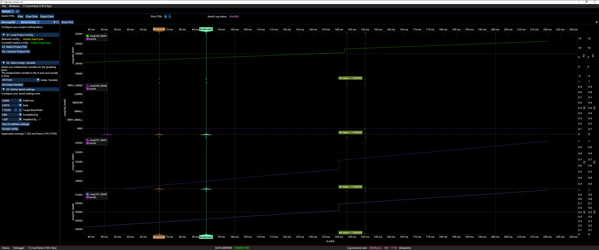
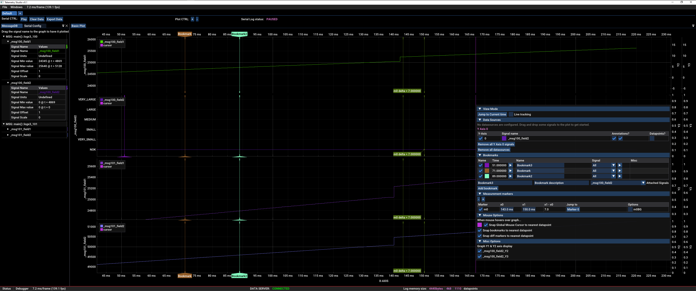
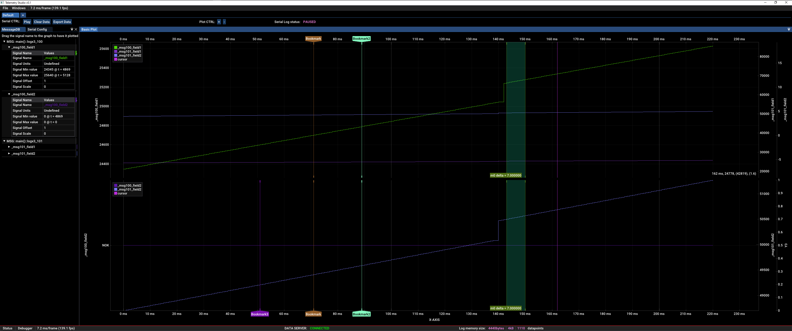
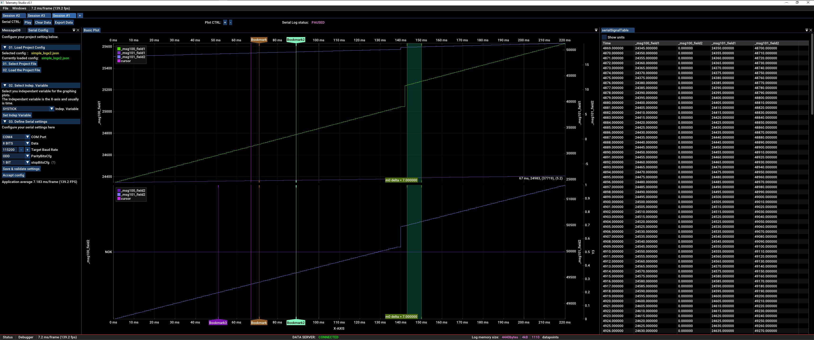
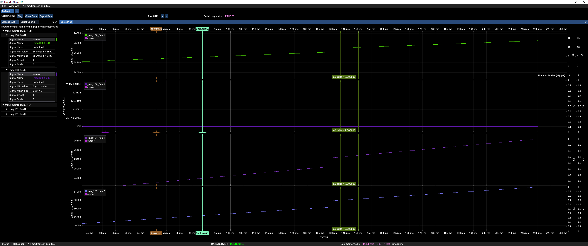

# Telemetry Studio Public Overview

Hello internet strangers, this project main purpose is to show some public images of a program I have been working on in my free time. 

Its main purpose is to show live telemetry data streaming from microcontrollers at buttery smooth framerates.

The program is currently private because this entire project started with me experimenting with various coding techniques regarding muti-threading, graphics programming, Rust & C++ FFI, etc. I do not intend to relase it as it currently is. Perhaps it might be paid software or open source in the future - I don't know yet.

## Quick Intro
In the automotive industry, it is common to debug and monitor ECU behaviour by watching the network traffic over CAN & LIN bus. Since the ECU is handling multiple concurrent operations at a time, we need to be able to monitor multiple state-machines, debug signals and other arbitrary data comping from the ECU in a graphical way over time. This program aims to be a "data oscilloscope" for these internal signals which you can then use to find bugs, implmenet a fix and then confirm the fix.

While this tool is aimed for streaming data from embedded devices, I aim to make it generic enough to stream data over any communication link (via native plugins, WASM, TCP/UDP sockets, websockets, BLE, USB, etc).

## Features

- [x] Stream time series telemetry and debug data from a Microcontroller over serial, USB or any other link
- [x] Streaming data is display at buttery smooth framerates.
- [x] Plot multiple "messsages" and "signals" per plot
- [x] Plot multiple plots per screen
- [x] Export data to CSV, SQL, Parquet, etc.
- [x] Import & Export sessions
- [x] Support multiple streaming sessions & devices
- [x] Capture analytical data (min value, max value, running avg, etc)
- [] Mostly static binary. A single executable file so you can quickly share the program and your saved session on USB drives. Currently we have 2 DLLs that need be copied for the program to work - but I will remove it eventually
- [x] drag and drop data signals onto plot. 

### Plotting features
- [x] Plot multiple "messsages" and "signals" per plot
- [x] Plot multiple plots per screen
- [x] Place private and global "bookmarks" at particular instant in time. Useful for drawing attention to specific events. Look at bookmark #3 (2nd plot, vertical )
- [x] Place measurement markers to measure between two points in time. See screenshots below
- [x] Add/remove signals into multiple plots *while* capturing incoming data. No need to stop & restart
- [x] Snap mouse to nearest captured datapoint
- [x] Infinte zoom in & out. See you data from a 1000m high level or zoom in up close. Obviously this depends on the resolution of your data
- [x] Bookmark/measurement pair "jumping". In the table view, clicking on the button will jump you to where the marker is on the plot
- [x] keyboard shortcuts to play/puase/set bookmarks/measurement pairs, etc
- [x] **Custom Y-axis markers** (see 2nd plot from top in screenshots, note the Y-axis values that have human readable names instead of numeric values. This is very handy when debugging things, especially state machines)

And alot more features planned (when I can get around to it). See to-do list below

## Screenshots
### Screenshot Notes
- Serial configuration pane
- Program will auto-detect new devices in the "COM Port" dropdown menu
- Multiple Y-axes

### Screenshot Notes
- Secondary option pane
- You can define multiple bookmarks with descriptions
- You can define "measurement" pairs to measure things

### Screenshot Notes
 - Serial configuration pane
 - Program will auto-detect new devices in the "COM Port" dropdown menu

### Screenshot Notes
 - Tabular data log
 - Split panes. One for plot data, one for tabular data

### Screenshot Notes
 - analytical data (on left side)

# Background & motivations
I work on hard-real time embedded sysetms as both hardware and software engineer. Often times when I write firmware, due to the nature of a real time system, I need to monitor the state of what my system and application is doing *over time* in order to catch and fix bugs. When you have a complex interactive system with input from the real world, aswell as complex interacting software modules, it is often and usually infeasible to test every condition and variation of interacting states of a system. So when bug is reported, you want to see what each sub-system or software module in your application is doing. This is why I created Telemetry monitor - to help me have better insight to what my system is doing, to catch and fix bugs.

## Debuggers vs multimeters vs Oscilloscopes

If I told you to measure a current or voltage at a particular instance in time, what tool would you use and what would that data tell you? You would of course use a digital multimeter. What if told you to monitor a a digital or analog signal over time? You would use an oscilloscope. Using these tools, you gain insight to what your system is doing depening on whether you need to monitor for a paricular value or if you want to monitor data over time.

My tool is the software equivalent of a oscilloscope. Its not a novel concept. You have variables in your code that you want to monitor over time and plotted on a X/Y graph for easy visualization. Think of it as a "data oscilloscope".

You might say, "why not use a debugger?". The problem with a debgugger is that it mostly commonly used as the software equivalnet of a digital multimeter. Using, breakpoints, watchpoints, etc...it only gives you data a particular point in time at which point you freeze your application. In a real time embbeded application, you often dont have this luxury of freezing the entire state becasue most embedded systems operate on events generated by the outside world in a real time manner. Therefore catching bugs and fixing them becomes much harder becasue the very act of stopping and measuring something alters the behaviour of the system.

### Isnt this just logging?

Well, yes actually. Instead of monitoring for human readble messages, you are serializing and sending out binary data or variables from your code and then displaying them on a multi-channel plot on your PC. The goal is to monitor raw data as it is modified and used over time and streamed out as fast as you can manage.

### Why not use a logic analyzer?

The problem with a logic analyzer is that is displays binary content. Zeroes and ones. I want to see the actual data inself visualized on a X/Y plot with a height of more than 1. Similar but actually different use cases which warrants a separate and more suited tool for the job.

# Support

This is a hobby project that I made during my free time intended for my own personal use. I might potentially open-source it or sell it. I dont offer any support at the moment. I am open to have testers/debugging support to help me refine this idea.

# Future features/ to-do list
- [] Build a database dynamically by streaming JSON data. Currently, the data must conform a schema
- [] Stream data over websockets, WASM, TCP/UDP, etc. Currently, data is ingest via serial
- [] proper plugin system. Create your own data sources, pipe them into this app and view your data
- [] SQL data browser with data filtering support?
- [] Clean up and make a better UI
- ...and tons more....just so much to do
